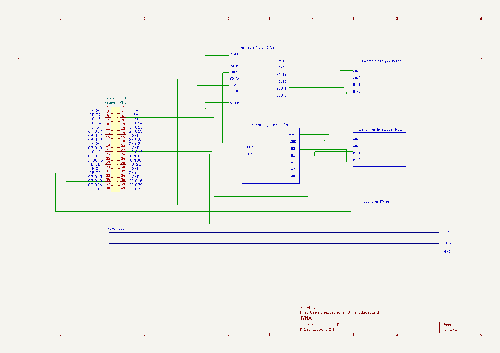
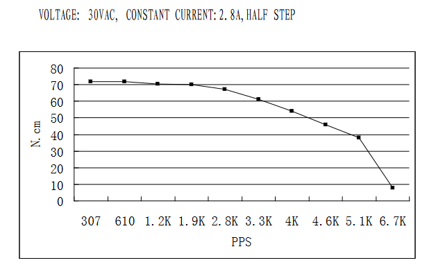
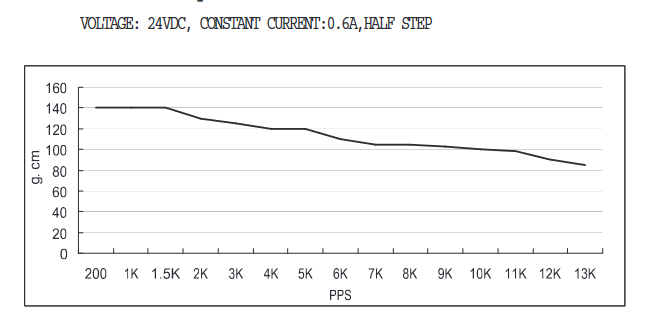

# Launcher Aiming
## Functionality
The Launcher Aiming subsystem will take in signals from the sensor post reciever and head on projectile sensing, determine the position of the ball and adjust the launcher's position accordingly. This subsystem will also calculate the timing to fire the projectile and send a signal to the launcher firing subsystem. The launcher's position is controlled by two motors: one to adjust the yaw (turntable) and one to adjust the pitch (launch angle).
## Constraints 
* C1: Create an interceptor capable of functioning
on its own without outside interaction.
* C3: Create an interceptor capable of fitting inside
a 1x1x1 foot box before powering on.
* C20: Launcher pitch and yaw must be controllable to a precision of within half a degree
* C21: Launcher time to aim must be less than 1 second.
* Aiming speed will be calculated from worst-case torque requirements provided by the Mechanical Engineering group
## Buildable Schematics
### Electrical Scheamtic

The electrical shematic shows the connections between the microcontroller [1], turntable motor driver [2], turntable motor [3], launch angle motor driver [4], and launch angle motor[5]. The microcontroller - Rasperry Pi 5, was chosen due to it having all the needed pins to drive the stepper motors while having ample processing power for the head-on sensing subsystem. The motors chosen was due to the torque requirements needed to move the launcher based on the launcher's weight and moment of inertia. The motor drivers were recomended by the site to control the motors based on the the motors' current rating.
## Analysis
### Aiming time
The Mechanical Engineering group requried 0.68 Nm of torque from the turntable motor to reach a time to move 180 degrees in 1 second. The selected motor's torque has a maximum torque of 0.73 Nm shown in the graph below obtained from the datasheet amps which satisfies the Mechanical Engineering group's torque requirement.

For the launch angle motor, the Mechanical Engineers required 0.013 Nm of torque to move the launcher's pitch. The selected motor for should provide ample torque with a maximum torque of 0.14 Nm at 0.6 A shown in the graph below obtained from the datasheet.

### Precision
Both stepper motors have a 1.8  degree step angle. Both drivers have capablility to have different step resolutions, including 1/2, 1/4, 1/8 steps. If selected to 1/4 step mode, the motors will have a precision of 0.45 degrees. This is within the requirement the launcher aiming having a precision of 1 degrees in both directions

## BOM
| Name of Item   | Description                                                                  | Part Number     | Manufacturer     | Quantity     | Price      | Total   |
|----------------|------------------------------------------------------------------------------|-----------------|------------------|--------------|------------|---------|
| Turntable Motor | The turntable motor allows the launcher to turn left and right                 | 1478           | Polulu      | 1        | 47.95       |  47.95    |
| Turntable Motor Driver     | The motor driver supplies the voltage and current to the motor.                                   | 3730           | Polulu      | 1            |  28.95        |  28.95     |
| Launch Angle Motor          | The motors will allow the launcher to move the pitch up and down.                 | 2267            | Pololu           | 1            |  21.95       |  21.95   |
| Launch Angle Motor Driver    | The motor driver supplies the voltage and current to the motor.                           | 2676            | Pololu           | 1   |  7.95        |  7.95    |
| Microcontroller| The microcontroller communicates with the master control and motor drivers.  | Raspberry Pi 5 4 GB RAM | Adafruit          | 1            | 60.00       | 60.00    |
| Total          |                                                                              |                 |                  |              | Total Cost | $166.80 |
  
## References
[1] Microcontroller https://www.adafruit.com/product/5812?gad_source=1&gclid=Cj0KCQjwzZmwBhD8ARIsAH4v1gXGg02jbP5Q13riRbMYuD5OUOXIthSaszyXwI7qs_mdn8cTXS-ut4QaAlArEALw_wcB

[2] Turntable Motor Driver https://www.pololu.com/product/3730 

[3] Turntable Motor https://www.pololu.com/product/1474

[4] Launch Angle Motor Driver https://www.pololu.com/product/2134

[5] Launch Angle Motor https://www.pololu.com/product/1204